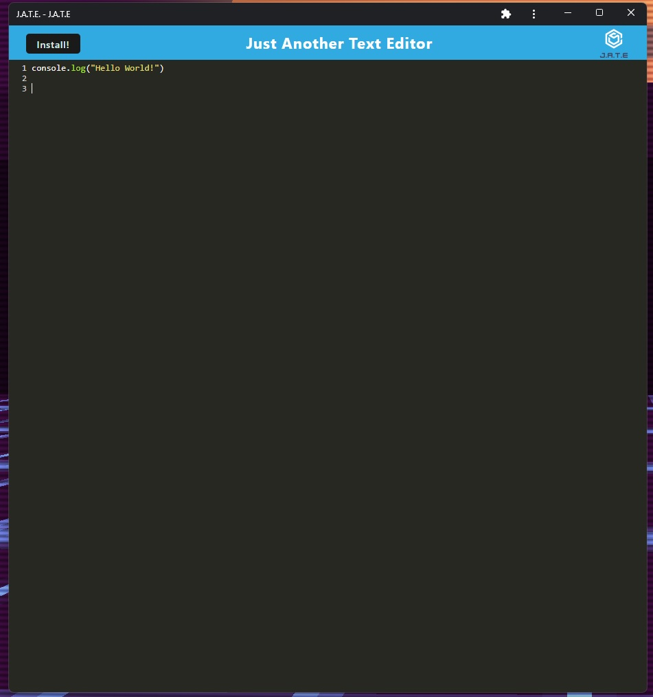

# PWA-Text-Editor

## Description

This app is a single-page text editor that meets the PWA criteria and has multiple data persistence techniques to ensure redundancy in case a particular option is not supported by the browser. It also functions offline.

The technology used are HTML, CSS, JavaScript, Node.js, Express.js, Webpack Plugins, and Heroku for deployment

## Usage

Please click on the deployed application link, after which you will click on the install button to start the installation process. The J.A.T.E. app will then be installed onto your desktop.

### Links:

1. URL of the functional, deployed application: https://xavier-text-editor.herokuapp.com/
2. URL of the GitHub repository: https://github.com/XvrTeo/PWA-Text-Editor
